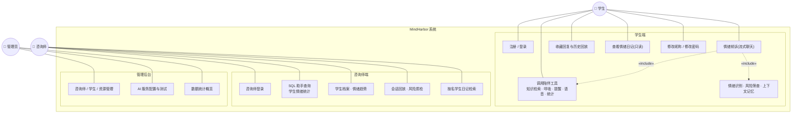
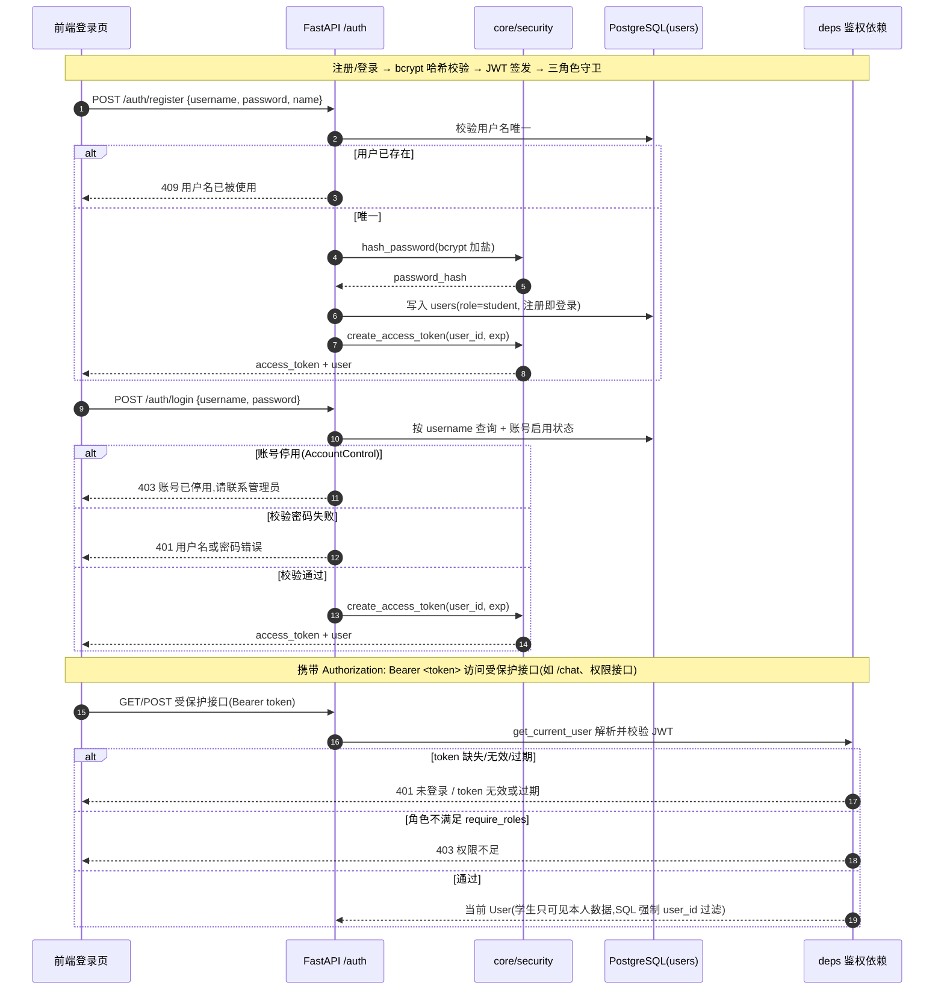
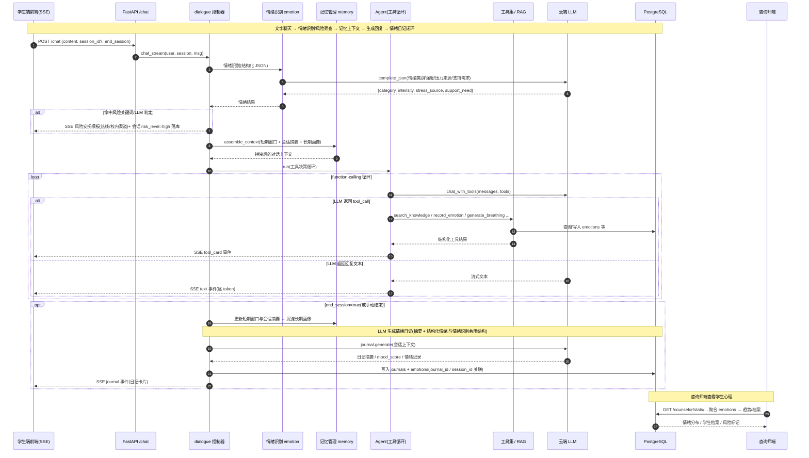
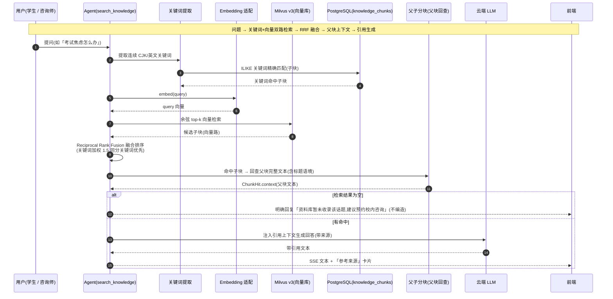

# MindHarbor — AI 心理咨询与情感陪伴助手 规格说明书

| 项目 | 内容 |
|---|---|
| 项目名称 | MindHarbor（心港）— 面向大学生的 AI 心理咨询与情感陪伴助手 |
| 版本 | v1.0 |
| 日期 | 2026-08-20 |
| 状态 | 已实现 M1–M4 后端 + 三角色前端联调（课程演示可用） |
| 上游文档 | `docs/superpowers/specs/2026-08-14-mindharbor-design.md`（架构设计）、`docs/api.md`（接口契约） |
| 技术栈 | Python 3.12 + FastAPI｜PostgreSQL + Milvus v3.0.0｜React 18 + Vite（三角色前端） |

> **模板说明**：本文档按照《AI 面试官课程项目规格说明书》的结构（账号与权限 / 数据管理 / 主流程 / 性能 / 接口）撰写，内容与实际代码一一对应。系统已实现的能力以「**已实现**」标注，模板要求但当前版本尚未落地的能力以「**规划中**」标注，避免规格与实际实现脱节。

---

## 3. 功能需求

### 3.1 账号与权限

#### 3.1.1 学生注册与登录

**输入**：注册时提交用户名、密码、昵称；登录时提交账号和密码。

**处理**：
- 注册校验用户名唯一性（数据库唯一约束），密码长度 ≥ 6 位；密码使用 `bcrypt` 加盐哈希存储（`core/security.py:hash_password`），**不保存明文**。
- 登录成功后签发 **JWT**（HS 算法，payload 内含 `sub=user_id` 与过期时间），前端以 `Authorization: Bearer <token>` 携带。
- 认证依赖 `deps.get_current_user`（`api/deps.py`）：未携带/无效令牌统一返回 **401**；角色不合法的请求返回 **403**。
- 数据隔离铁律：所有学生端查询强制按 `user_id` 过滤（会话、日记、收藏、提醒），任何接口只允许操作本人数据（如 `reminders.py` 对他人提醒返回 403）。
- 支持修改基础资料（当前仅昵称 `name`；邮箱/手机为后续功能）与修改密码（须校验旧密码；`role`/`username` 固定不可改）；改密后旧 JWT 仍有效（无 token 黑名单，到期自然失效）。

**输出**：登录态（`access_token` + `token_type`）、当前用户信息（`id/username/name/role`）或明确错误提示（如「用户名已存在」「密码至少 6 位」「旧密码错误」「role/username 不可修改」）。

**对应接口**：
| 方法 | 路径 | 说明 |
|---|---|---|
| POST | `/api/v1/auth/register` | 注册（成功即登录） |
| POST | `/api/v1/auth/login` | 登录 |
| GET | `/api/v1/auth/me` | 当前用户信息 |
| PATCH | `/api/v1/auth/me` | 修改基础资料（仅昵称 name） |
| PUT | `/api/v1/auth/password` | 修改密码（校验旧密码） |

**种子账号**（`scripts/seed.py`）：学生 `student / student123`。

#### 3.1.2 咨询师 / 管理员账号与权限

**输入**：同一 JWT 登录体系下的教师账号。

**处理**：
- 三角色（`student / counselor / admin`）共用登录态与后端 API，前端按角色路由隔离，后端按角色鉴权。
- **咨询师端**：`POST /counselor/chat` 与 `GET /counselor/stats/*` 全部经 `require_roles("counselor", "admin")`（`api/deps.py:require_roles`）守卫；工具集为咨询师专属注册表 `counselor_registry`（3 个工具：学生情绪统计 SQL、学生日记检索、异常学生识别），**与学生会话/日记生成工具完全隔离**，避免权限混用。
- **管理端**：`/api/v1/admin/*` 整组由 `require_roles("admin")` 守卫（`admin_module/router.py:32` 依赖注入），仅管理员可进行咨询师/学生/资源的增删改与 AI 服务配置管理，遵循最小权限原则。
- SQL Agent 权限由角色所在层保证：学生端不可注入 `user_id` 之外的表，咨询师端可查 `users` 表、但入口被角色校验限制。

**输出**：咨询师/管理端对话结果、统计聚合数据或当前角色信息（`/auth/me` 返回 `role`，前端据此路由）。

**对应接口**：
| 方法 | 路径 | 说明 | 权限 |
|---|---|---|---|
| POST | `/api/v1/counselor/chat` | 咨询师 SQL 助手对话（SSE） | counselor / admin |
| GET | `/api/v1/counselor/stats/*` | 学生心理统计与档案 | counselor / admin |
| GET/POST/PATCH/DELETE | `/api/v1/admin/*` | 后台数据管理 | admin |

### 3.2 学生端首页与会话

#### 3.2.1 首页总览

**功能描述**：学生登录后进入聊天主页——该页即信息总览入口，聚合展示：进行中会话、常用练习（呼吸引导）、最新情绪日记入口、收藏与历史入口。

**输入**：当前登录学生身份。

**处理**：后端按 `user_id` 返回会话列表（`GET /chat/sessions?status=active` 分页）、提醒列表（`GET /reminders/mine`）等；首页各卡片数据来自独立接口，前端聚合渲染。

**输出**：进行中的会话列表、待办提醒、可继续对话的入口与快捷练习。

**对应接口**：`GET /chat/sessions`、`GET /reminders/mine`。

#### 3.2.2 个人资料维护

**功能描述**：支持查看及更新基础资料，并独立修改密码。

**输入**：当前登录学生身份；更新字段（昵称 `name`）、旧密码、新密码。

**处理**：
- 后端校验当前身份（JWT），更新昵称 `name`（非空、1–64 字符）；`role`/`username` 不可改（显式传入返回 400）；
- 邮箱/手机号等更多资料字段为**后续功能**，暂不提供；
- 修改密码时先 `bcrypt` 校验旧密码，随后写入新密码哈希；旧 JWT 保持有效。
- 写库成功后返回更新后的个人资料 / 成功提示。

**输出**：更新后的用户信息（`id/username/name/role`）或明确错误提示。

**对应接口**：`GET /auth/me`、`PATCH /auth/me`、`PUT /auth/password`。

### 3.3 情绪数据与情绪日记管理

> 与 AI 面试官项目的「简历管理」对应：简历是面试的数据底座，**情绪日记/情绪记录**是 MindHarbor 的数据底座——全部由对话闭环自动生成，**不设手动打卡**。

#### 3.3.1 情绪识别与日记生成（数据自动入库）

**功能描述**：学生在聊天过程中，后端对每轮对话进行情绪识别；会话结束（或带 `end_session=true`）时由 LLM 基于整轮对话生成**情绪日记**，级联生成**结构化情绪记录**落库。

**处理**：
1. 用户消息进入 `dialogue.py` 主流程；
2. LLM 情绪识别一次调用输出结构化 JSON：`{emotion: 类别, intensity: 0-10, stress_source, support_need}`（类别枚举固定 `[anxious, sad, angry, lonely, tired, calm, hopeful]`）；
3. 会话结束时生成日记 `journals(summary, content, mood_score)`，并提取情绪记录写入 `emotions(category, intensity, stress_source, support_need)`，以 `journal_id` / `session_id` 关联来源；
4. 情绪数据**仅由该闭环产出**，学生端不可修改、不可手动补录；`record_emotion` 工具与日记共写同一张 `emotions` 表，口径统一。

**输出**：`POST /chat/sessions/{id}/end` 返回结果，并在 SSE 流中推送 `journal` 类型事件（前端渲染日记卡片）。

**对应接口**：`POST /chat/sessions/{session_id}/end`、`POST /chat`（`end_session=true` 时）。

#### 3.3.2 日记查看与情绪数据只读

**功能描述**：学生只读查看自己的情绪日记列表与详情；情绪数据的**趋势分析/聚合查看**属咨询师端能力（见 §3.7）。

**输入**：当前登录学生身份（`journal_id` 必须属于本用户，否则 404/403）。

**处理**：按 `user_id` 过滤返回日记列表（分页）与单篇详情。

**输出**：日记列表 / 详情。

**对应接口**：`GET /journals/mine`、`GET /journals/mine/{journal_id}`。

**解析失败兜底（对应简历解析失败语义）**：若模型调用失败，对话模块返回错误事件并保留本次会话与已有消息，不产生残缺日记，便于排查重试。

### 3.4 会话管理

#### 3.4.1 会话创建与进入

**功能描述**：学生发起第一句倾诉即创建新会话；也可继续已有进行中会话。

**输入**：`content`（首条消息，空内容被拒绝）。

**处理**：
- `POST /chat` 缺省 `session_id` 时以本人身份创建 `sessions(user_id, title, started_at, status=active, risk_level=low)`；
- 携带 `session_id` 时校验归属，仅可继续自己的 **active** 会话；
- 后端在**同一次 SSE 请求内**完成：情绪识别 → 风险筛查 → 记忆上下文组装 → Agent 工具决策 → 流式回复 →（可选）日记生成。无独立“出题”阶段，首条回复即陪伴回应。

**输出**：SSE 事件流（`text` 回复增量 / `tool_card` 工具卡片 / `error` 错误）。

**对应接口**：`POST /chat`、`GET /chat/sessions/{session_id}`。

#### 3.4.2 会话列表、回放与结束

**功能描述**：支持按状态（`active` 进行中 / `closed` 已结束）分页查看会话、读取消息回放、手动结束会话。

**输入**：`status`、`page`、`page_size`；`session_id`。

**处理**：
- 列表按 `user_id` 过滤、按状态筛选、分页返回；
- 消息回放只读取本人会话的消息；
- `POST /chat/sessions/{id}/end` 将状态置为 `closed` 并触发情绪日记生成；**已结束会话不可再续聊，只读回放**。

**输出**：会话列表 / 会话详情 / 消息列表 / 结束结果。

**对应接口**：
| 方法 | 路径 | 说明 |
|---|---|---|
| GET | `/chat/sessions?status=active\|closed&page=&page_size=` | 会话列表（分页） |
| GET | `/chat/sessions/{session_id}` | 会话详情 |
| GET | `/chat/sessions/{session_id}/messages` | 消息列表 |
| POST | `/chat/sessions/{session_id}/end` | 结束会话并生成情绪日记 |

### 3.5 AI 陪伴对话流程

#### 3.5.1 消息接收与风险筛查

**功能描述**：接收学生文字倾诉，即时识别情绪并做危机风险筛查。

**处理**：
1. `POST /chat`（SSE）接收消息，空白内容拒绝；
2. **情绪识别**：轻量 LLM 调用输出结构化情绪（类别 / 强度 / 压力来源 / 支持需求）；
3. **风险筛查**：危机关键词库 + LLM 判定双重保障，命中即返回**风险回复模板**（温和明确，给出危机干预热线 400-161-9995 与校内咨询渠道，见设计文档附录 B），并将会话 `risk_level` 置为 `high`，咨询师端置顶关注；
4. 风险判定结果随 `tool_card` / 会话 `risk_level` 字段下发给前端。

**输出**：SSE 文本回复（含风险安抚文案）、`risk_level` 标记。

#### 3.5.2 上下文记忆管理

**功能描述**：多轮对话与跨会话记住对陪伴质量至关重要，由 `ai/memory.py` 统一管理三层记忆。

**处理**：
- **短期记忆**：`messages` 表最近 N 轮滑动窗口，每轮对话前组装、后写入；
- **会话摘要**：长会话压缩摘要（话题/情绪走向），存 `sessions.summary`；
- **长期记忆/画像**：`user_memories` 沉淀用户长期事实与偏好（如“正在备考六级”“失眠”），对话中识别到重要信息时写入、次轮召回注入；
- 隐私约束：仅沉淀明确且非敏感信息，风险/敏感内容只做会话标记、不进入长期记忆。

**输出**：拼接后的对话上下文（含知识库引用、长期画像）注入系统提示词。

#### 3.5.3 Agent 工具循环（6 项能力）

**功能描述**：`ai/agent.py` 的 function-calling 循环让 LLM 在对话中自主调用工具，结果以卡片形式返回前端。

**处理**：消息 → LLM 决策（`chat_with_tools`）→ 执行 `handler` → 结果回填 → 最多 `MAX_TOOL_ROUNDS` 轮，直至 LLM 输出最终回复；单轮可调用多个工具（如 `search_knowledge` + `generate_breathing` 组合）。

**工具清单**：

| 工具 | 作用 | 前端卡片 |
|---|---|---|
| `search_knowledge` | RAG 知识库检索（RRF 混合检索 + 父子分块），带引用来源 | 参考来源卡片 |
| `record_emotion` | 写入情绪记录（与日记闭环共用 `emotions` 表） | 情绪确认卡片 |
| `generate_breathing` | 478 呼吸练习分步引导 | 分步引导卡片 |
| `create_reminder` | 创建日程提醒 | 提醒确认卡片 |
| `recommend_resources` | 按情绪/需求推荐心理资源 | 资源卡片 |
| `query_emotion_stats` | **SQL Agent**：自然语言 → SELECT → 只读执行 → 中文解释 | 情绪统计卡片 |

**SQL Agent 安全策略（对应面试题评分逻辑的可信性要求）**：
- LLM 仅负责把自然语言转成 SELECT（temperature=0）；
- `sqlglot` AST 校验：单条语句、必须 SELECT、表白名单（学生端 `{emotions, journals, sessions}`，咨询师端额外含 `users`）；
- 学生端强制注入 `WHERE user_id = <uid>`（数据隔离）；咨询师端无注入、由角色校验保证权限；
- 强制 `LIMIT 100`；独立连接 `SET TRANSACTION READ ONLY` 执行，数据库层面拒绝任何写操作。

**输出**：SSE `tool_card` 事件流 + 最终 `text` 回复。

#### 3.5.4 语音扩展（句子级流式，voice_reply 开关，随 /chat）

**功能描述**：语音为普通聊天的**可选扩展**：用户开启后，回复按**句子**切分，每句文本输出后立即合成该句音频，以 `audio_chunk{seq,text,data,format}` 事件紧跟发出——语音与文本**逐句同步**（而不是文本整段结束后返回整段 URL）。语音输入由浏览器 ASR 转文本，照常走 `/chat`。

**处理**：
- 请求新增字段 `voice_reply`（默认 false）；`dialogue.chat_stream` 在文本流内按标点/长度切句，句完整即调 `adapters/tts.synthesize` 合成该句，紧跟对应 `text` 事件发出 `audio_chunk`（base64 mp3）；流结束时未到句界的尾句同样合成；
- 文本不被 TTS 阻塞（句子级串行，延迟远小于整段）；某句 TTS 失败仅跳过该句音频，文本照常；
- 会话/风险/记忆/Agent/日记闭环与文字聊天完全一致（同一 `POST /chat` 通道）；风险命中按风险模板返回（不合成语音）。

**对应接口**：`POST /chat`（新增字段与事件见 `docs/voice-chat-protocol.md`）。

### 3.6 收藏、提醒、练习与历史

**功能描述**：学生可将满意的 AI 回复收藏；可查看/完成日程提醒；可进行呼吸练习；可回看历史会话与情绪日记。

| 功能 | 说明 | 接口 |
|---|---|---|
| 收藏回复 | 收藏/取消收藏消息，只允许本人 | `POST/DELETE /favorites/{message_id}`、`GET /favorites/mine` |
| 日程提醒 | 查看本人提醒、标记已完成（Agent `create_reminder` 写入） | `GET /reminders/mine`、`PATCH /reminders/{id}/done` |
| 呼吸练习 | 由 `generate_breathing` 工具返回分步引导卡片 | SSE `tool_card` |
| 历史 | 已结束会话只读回放 + 情绪日记列表 | `GET /chat/sessions?status=closed`、`GET /journals/mine` |

### 3.7 咨询师端：学生心理管理

**功能描述**：咨询师/管理员查看学生心理数据、情绪趋势与风险会话，辅助形成学生心理档案；并可通过 **SQL 助手** 以自然语言查询统计。

| 能力 | 说明 | 接口 |
|---|---|---|
| SQL 助手对话 | 咨询师专属 Agent（`counselor_registry`：`query_student_stats` SQL Agent / `search_student_journals` 日记检索 / `find_at_risk_students` 异常学生识别） | `POST /counselor/chat`（SSE） |
| 情绪分布 | 全体学生情绪类别分布（ECharts） | `GET /counselor/stats/emotion-distribution` |
| 学生列表 | 按姓名搜索、风险等级筛选学生 | `GET /counselor/stats/students` |
| 学生档案 | 基础信息、多日情绪趋势（7/14/30 天折线）、情绪日记（可跳转关联会话）、近期会话摘要与风险标记 | `GET /counselor/stats/students/{student_id}/detail` |
| 会话消息回放 | 会话完整消息回放（档案弹窗内） | `GET /counselor/stats/sessions/{session_id}/messages` |

**权限**：`require_roles("counselor", "admin")`；只读 + 质检，不提供写操作。日记与情绪数据全部来自对话闭环（见 §3.3），保证**可溯源**：日记 → 关联会话 → 消息回放。

### 3.8 管理端（admin）：后台数据与 AI 服务管理

**功能描述**：管理员维护咨询师、学生、心理资源，并管理 LLM/Embedding/TTS 服务配置。

| 模块 | 说明 | 接口 |
|---|---|---|
| 总览 | 系统概览 | `GET /admin/overview` |
| AI 服务配置 | 查看/修改/测试 LLM、Embedding、TTS 服务的 base_url、密钥占位与降级策略 | `GET /admin/api-configs`、`PATCH /admin/api-configs/{service_id}`、`POST /admin/api-configs/{service_id}/test`、`GET /admin/api-status` |
| 咨询师管理 | 列表 / 新增 / 更新（专长、简介） | `GET/POST /admin/counselors`、`PATCH /admin/counselors/{user_id}` |
| 学生管理 | 列表 / 更新（如风险标记） | `GET /admin/students`、`PATCH /admin/students/{user_id}` |
| 心理资源管理 | 资源卡片增删改查 / 上下架 | `GET/POST /admin/resources`、`PATCH /admin/resources/{id}`、`DELETE /admin/resources/{id}` |

**权限**：全部 `require_roles("admin")`；写操作通过 `admin_module/sync.py` 同步到局域网镜像库（课程多机演示场景）。

---

## 4. 性能

| 维度 | 目标 | 现状与措施 |
|---|---|---|
| 响应时间 | 认证、会话列表、日记列表等普通接口在本机/校园网演示环境 **2 秒内**返回 | 均为轻量 CRUD + 分页查询（PostgreSQL 索引）；`GET /health` 秒回 |
| 主流程时延 | 聊天为 **SSE 流式**：首 token 尽快返回，逐 token 渲染；整轮（情绪识别 + 风险 + 记忆 + Agent + 回复）在云 LLM 正常时于合理时限内完成（实测真机全链路联调通过：工具调用 → 流式 text → RAG 引用 → 日记落库） | 与模板“任务队列回写”不同：本项目采用**单请求内同步编排 + SSE 流式分段渲染**，避免额外队列组件，适合课程演示；模型降级时返回 `error` 事件而非挂起 |
| 并发性 | 至少 5 名用户同时浏览、多会话顺序处理 | 单进程 FastAPI + 连接池；SQL Agent 只读连接互相独立；演示/测试环境验证充分 |
| 可靠性 | 消息、日记、情绪记录、评分数据**持久化**到 PostgreSQL | 全部业务数据落库；无内存态关键数据 |
| 失败处理 | 任务失败保留原因便于排查 | LLM/TTS 异常经 `adapters/` 捕获并降级（语音→文字卡片）；工具失败返回 `error` 卡片，不中断会话 |
| 可维护性 | 字段/端口/环境变量/启动顺序有文档说明 | 见 §5 接口清单、《README.md》、`backend/.env.example`、`docs/api.md` 与 `docs/progress.md`（含每次变更记录） |

**测试基线**：后端 `pytest` 全量 **125 passed 全绿**（AI 能力用 monkeypatch 替换 `adapters/` 模型调用，不真实请求 LLM）；前端 `pnpm build`（`tsc -b && vite build`）通过。测试连接本机 PostgreSQL（localhost:5432），不依赖局域网库。

---

## 5. 接口

### 5.1 角色与通用约定

- 接口基址：`http://172.16.2.91:8000/api/v1`（开发机虚拟局域网）。
- 数据格式：请求/响应 JSON；聊天类为 **SSE**（`data: {type, payload}` 事件流），SSE 事件 `type` 枚举：`text`（回复增量）/ `tool_card`（工具卡片）/ `journal`（日记卡片）/ `error`。
- 鉴权：除 `health` / `auth/login` / `auth/register` 外，请求头携带 `Authorization: Bearer <access_token>`；未认证 **401**，角色不足 **403**。

### 5.2 学生端接口

| 方法 | 路径 | 说明 | 权限 |
|---|---|---|---|
| GET | `/health` | 健康检查 | 公开 |
| POST | `/auth/register` | 注册（成功即登录） | 公开 |
| POST | `/auth/login` | 登录 | 公开 |
| GET | `/auth/me` | 当前用户信息 | 学生 |
| PATCH | `/auth/me` | 修改基础资料（仅昵称 name） | 学生 |
| PUT | `/auth/password` | 修改密码（校验旧密码） | 学生 |
| POST | `/chat` | 发送消息（SSE 流式；`session_id` 缺省建新会话；`end_session=true` 结束并生成日记） | 学生 |
| GET | `/chat/sessions` | 会话列表（`status=active\|closed`，分页） | 学生 |
| GET | `/chat/sessions/{session_id}` | 会话详情 | 学生 |
| GET | `/chat/sessions/{session_id}/messages` | 会话消息列表 | 学生 |
| POST | `/chat/sessions/{session_id}/end` | 结束会话并生成情绪日记 | 学生 |
| GET | `/journals/mine` | 我的情绪日记列表（只读） | 学生 |
| GET | `/journals/mine/{journal_id}` | 日记详情（只读） | 学生 |
| POST | `/favorites/{message_id}` | 收藏消息 | 学生 |
| DELETE | `/favorites/{message_id}` | 取消收藏 | 学生 |
| GET | `/favorites/mine` | 我的收藏 | 学生 |
| GET | `/reminders/mine` | 我的提醒 | 学生 |
| PATCH | `/reminders/{reminder_id}/done` | 提醒标记完成 | 学生 |

### 5.3 咨询师端接口

| 方法 | 路径 | 说明 | 权限 |
|---|---|---|---|
| POST | `/counselor/chat` | SQL 助手对话（SSE；工具集：学生统计 SQL / 日记检索 / 异常识别） | counselor / admin |
| GET | `/counselor/stats/emotion-distribution` | 全体情绪类别分布 | counselor / admin |
| GET | `/counselor/stats/students` | 学生列表（搜索/风险筛选） | counselor / admin |
| GET | `/counselor/stats/students/{student_id}/detail` | 学生档案（资料/情绪趋势 7-14-30 天/日记/会话/风险） | counselor / admin |
| GET | `/counselor/stats/sessions/{session_id}/messages` | 会话消息回放 | counselor / admin |

### 5.4 管理端接口（admin）

| 方法 | 路径 | 说明 | 权限 |
|---|---|---|---|
| GET | `/admin/overview` | 系统概览 | admin |
| GET | `/admin/api-status` | AI 服务在线状态 | admin |
| GET | `/admin/api-configs` | AI 服务配置列表 | admin |
| PATCH | `/admin/api-configs/{service_id}` | 更新服务配置 | admin |
| POST | `/admin/api-configs/{service_id}/test` | 测试服务连通性 | admin |
| GET/POST | `/admin/counselors` | 咨询师列表 / 新增 | admin |
| PATCH | `/admin/counselors/{user_id}` | 更新咨询师 | admin |
| GET | `/admin/students` | 学生列表 | admin |
| PATCH | `/admin/students/{user_id}` | 更新学生（如风险标记） | admin |
| GET/POST | `/admin/resources` | 心理资源列表 / 新增 | admin |
| PATCH | `/admin/resources/{resource_id}` | 更新资源 | admin |
| DELETE | `/admin/resources/{resource_id}` | 删除资源 | admin |

### 5.5 数据存储

| 类型 | 说明 |
|---|---|
| 业务数据 | PostgreSQL：`users` / `sessions` / `messages` / `journals` / `emotions` / `favorites` / `reminders` / `user_memories` / `resources` / `counselors` / `knowledge_docs` / `knowledge_chunks` |
| 向量库 | Milvus v3.0.0（本机 Docker :19530），`knowledge_chunks` collection 存储知识库子块向量，按 chunk id 关联 PG |
| 目录文件 | `backend/data/knowledge/*.md` 知识库源文档（入库管道 `scripts/ingest_knowledge.py` 批量入库） |
| AI 主输入 | RAG 检索/情绪识别等以**文本**为主链路；`adapters/`（LLM/Embedding/TTS）统一封装，密钥仅存环境变量 |

### 5.6 启动顺序（多人联调复现）

1. 启动 PostgreSQL（docker compose 或本地）与 Milvus（本机 Docker 已就绪）；
2. `backend/`：`cp .env.example .env` 填密钥 → `source .venv/bin/activate` → `pip install -r requirements.txt` → `python scripts/init_db.py` 建表 → `python scripts/seed.py` 种数据 → `uvicorn app.main:app --host 0.0.0.0 --port 8000`；
3. `frontend/`：`pnpm install` → `pnpm dev`（vite 代理 `/api` → :8000）；
4. 后端测试：`cd backend && pytest tests -v`（不真实调用 LLM）。

---

## 附录 C:系统设计图(Mermaid)

> 图源文件:`docs/diagrams/*.mmd`,可在线/本地 Mermaid 渲染。

### 用例图 — 三角色 × 用例与包含关系(系统边界)



### C.2 认证与权限序列 — 注册/登录 → bcrypt → JWT 签发 → 角色守卫



### 聊天与情绪日记闭环序列 — 文字聊天 → 情绪/风险 → 记忆 → Agent → 流式回复 → 日记落库



### SQL Agent 安全查询序列 — 自然语言 → SELECT → AST 校验 → 数据隔离/只读执行 → 解释

```mermaid
sequenceDiagram
    autonumber
    participant U as 用户(学生 / 咨询师)
    participant AG as Agent 对话
    participant LLM as 云端 LLM
    participant VL as sqlglot 校验层
    participant DB as PostgreSQL<br/>(SET TRANSACTION READ ONLY)

    Note over U,DB: 自然语言 → SELECT → AST 校验 → 数据隔离/只读执行 → 中文解释

    U->>AG: 问题「我最近的情绪分布如何」/「学生焦虑情况」
    AG->>LLM: SQL_GEN_PROMPT + 问题 → 生成 SELECT(temperature=0)
    LLM-->>AG: 一句 SELECT(只允许查白名单表)

    AG->>VL: 校验:单条语句 + 必须 SELECT + 表白白名单
    alt 不合法(多语句 / DML / 非白名单表)
        VL-->>AG: ValueError → 友好错误 tool_card(不执行)
    else 合法
        VL->>DB: 学生端注入 WHERE user_id = <uid>;强制 LIMIT 100<br/>咨询师端仅 LIMIT(可查任意/全体)
        DB->>DB: SET TRANSACTION READ ONLY(物理拒写)
        DB-->>VL: 查询结果(headers/rows,Decimal→float 等可序列化处理)
        VL-->>AG: 结构化行数据
        AG->>LLM: EXPLAIN_PROMPT + 结果 → 中文解释(≤3 句)
        LLM-->>AG: 解释文本
    end

    AG-->>U: SSE tool_card(统计表/解释) + text 总结
```

### RAG 混合检索序列 — 关键词 + 向量双路 → RRF 融合 → 父块上下文 → 引用


