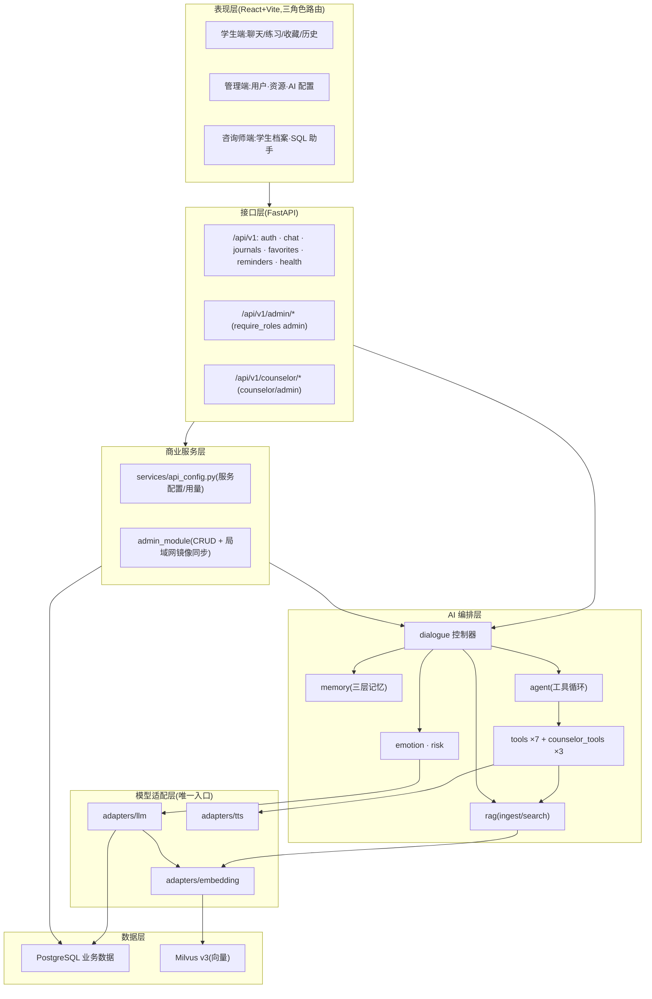
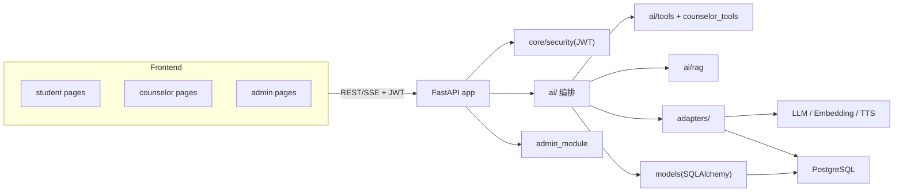
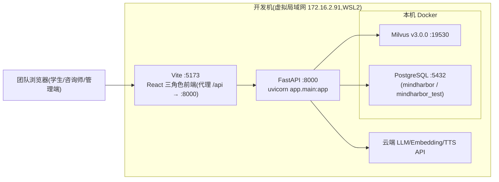

# MindHarbor — AI 心理咨询与情感陪伴助手 架构说明

| 项目 | 内容 |
|---|---|
| 文档编号 | MH-ARCH-001 |
| 版本 | v1.0 |
| 日期 | 2026-08-21 |
| 状态 | 与当前实现一致(后端 M1–M4 ✅、三角色前端 ✅、M8 集成联调 ⏳) |
| 上游文档 | 架构设计 `docs/superpowers/specs/2026-08-14-mindharbor-design.md`;实施计划 `docs/superpowers/plans/2026-08-14-mindharbor-implementation.md`;接口 `docs/api.md`;规格/开发计划 `docs/2026-08-20-mindharbor-course-spec.md`、`docs/2026-08-21-mindharbor-development-plan.md` |

---

## 1. 简介

### 1.1 目的

本文档描述 MindHarbor 的软件架构:构架目标与约束、关键功能视图、层次结构、逻辑视图(用户服务层 / 商业服务层 / AI 能力服务层 / 数据服务层)与部署视图,使评审方与开发者对系统"如何组织、为何这样组织"有统一认识。文档内容与当前代码一致,可在迭代演进时同步更新。

### 1.2 范围

覆盖:三角色前端 + 单一 FastAPI 后端的整体结构;对话/情绪/日记/记忆/Agent/RAG 闭环的编排方式;SQL Agent 安全策略;数据存储(PostgreSQL + Milvus)与部署形态。不属于范围:语音识别的后端处理、生产级高可用、简历/招聘相关领域功能(本项目为心理陪伴域)。

### 1.3 参考资料

| 类别 | 文档 |
|---|---|
| 需求与设计 | `docs/superpowers/specs/2026-08-14-mindharbor-design.md` |
| 实施 | `docs/superpowers/plans/2026-08-14-mindharbor-implementation.md` |
| 契约 | `docs/api.md`、`docs/openapi.json` |
| 课程文档 | `docs/2026-08-20-mindharbor-course-spec.md`、`docs/2026-08-21-mindharbor-development-plan.md`、`docs/progress.md` |

---

## 2. 构架表示方式

- **视图体系**:采用「4+1」变体——逻辑视图(§6)、功能视图(§4)、数据视图(§6.5)、部署视图(§6.6),关键场景以序列图补充分布于功能视图与 `docs/diagrams/`。
- **建模语言**:统一使用 Mermaid(flowchart / sequenceDiagram / block-diagram),图源见 `docs/diagrams/mindharbor-*.mmd`,可在线渲染。
- **模块命名**:与代码目录一致(如 `app/ai/tools`、`app/admin_module`),便于读者直接定位源码。

---

## 3. 构架目标和约束

| 维度 | 内容 |
|---|---|
| 业务目标 | 完成「文字聊天 → 情绪识别/风险筛查 → 上下文记忆 → 生成回复 → 情绪日记/记录落库 → 咨询师端情绪趋势」的数据闭环;提供学生/咨询师/管理员三角色入口 |
| 技术目标 | 单进程 FastAPI 模块化单体,边界清晰可独立测试;云端 LLM API(function calling)承载对话;课程演示环境 5 并发稳定 |
| 质量属性 | **防幻觉**:专业内容必须走 RAG 引用,检索不到明确说明;安全兜底(SQL Agent 只读白名单、风险话术即时响应);教学透明(工具/提示词/上下文拼接显式可见);可维护(adapters 统一替换供应商) |
| 设计约束 | ① **AI 能力只经 `app/adapters/`**(LLM/Embedding/TTS),禁止直连供应商;② 情绪类别枚举固定 `[anxious, sad, angry, lonely, tired, calm, hopeful]`;③ SQL Agent 只读连接 + SELECT 白名单 + AST 校验,学生端强制注入 `user_id`;④ 情绪记录仅在 LLM 生成日记时一并产出;⑤ 学生端日记只读查看自己的,情绪趋势仅咨询师端;⑥ 密钥只进环境变量,禁止提交仓库;⑦ JWT + 角色权限中间件;⑧ 前端 TypeScript 严格模式、后端 Python 3.12 类型注解 |
| 假设 | 团队虚拟局域网 `172.16.2.91:8000` 可访问;云端 AI 服务可用(免费额度);WSL2 + 本机 Docker(PostgreSQL / Milvus v3.0.0)承载数据 |

---

## 4. 关键功能视图

> 图中实线为调用/数据流,虚线为依赖或事件。每个功能对应 `docs/diagrams/` 中的序列图。

### 4.1 情绪识别与日记生成功能(数据底座)

**职责**:每轮对话即时输出结构化情绪;会话结束(或 `end_session=true`)由 LLM 生成情绪日记并级联生成情绪记录,数据仅来自对话闭环、不可手动补录。

```
用户消息
  → emotion.analyze():LLM 结构化输出{category, intensity, stress_source, support_need}
  → 会话结束 → LLM 生成 journals(summary, content, mood_score)
  → 提取 emotions(category, intensity, stress_source, support_need) 挂 journal_id/session_id
  → 咨询师端按日/周聚合 emotions → 情绪趋势/档案
```

**相关模块**:`ai/emotion.py`、`ai/journal.py`、`api/journals.py`、`api/counselor/stats.py`。
**接口**:`POST /chat`(SSE 内 `journal` 事件)、`POST /chat/sessions/{id}/end`、`GET /journals/mine`、`GET /counselor/stats/*`。
**图**:`mindharbor-chat-sequence.mmd`。

### 4.2 AI 陪伴对话功能(主链路)

**职责**:消息 → 情绪识别 → 风险筛查 → 记忆上下文组装 → Agent 工具决策 → 流式回复 →(可选)日记生成;一次 SSE 请求内同步完成。

```
POST /chat(SSE)
  → dialogue.chat_stream:情绪识别 → 风险筛查(关键词库+LLM 双保险,命中返回热线模板并置 risk_level=high)
  → memory.assemble_context(短期 N 轮 + 会话摘要 + 长期画像)
  → agent.run(function-calling 循环,7 工具)
  → 流式 text / tool_card / journal 事件 → 消息与记忆更新落库
```

**相关模块**:`ai/dialogue.py`、`ai/memory.py`、`ai/agent.py`、`ai/tools/`、`api/chat.py`、`adapters/llm.py`。
**接口**:`POST /chat`、`GET /chat/sessions*`。
**图**:`mindharbor-chat-sequence.mmd`。

### 4.3 知识库检索与 RAG 功能

**职责**:心理科普知识库的入库与在线检索;父子分块 + RRF 混合检索 + 父块回查,带引用来源,检索不到不编造。

```
入库:data/knowledge/*.md → 节(父块)切分 → 子块注入[文档>节]前缀向量化 → Milvus + PG(元数据)
检索:提取连续 CJK/英文关键词 → PG ILIKE 精确匹配 + Embedding→Milvus 向量 top-k
  → RRF 融合(关键词加权 1.5)→ 父块回查 → LLM 带引用生成 →「参考来源」卡片
```

**相关模块**:`ai/rag/`(ingest / chunking / search)、`adapters/embedding.py`、`ai/tools/search_knowledge.py`、`scripts/ingest_knowledge.py`。
**图**:`mindharbor-rag-sequence.mmd`。

### 4.4 语音陪伴(HTTP 语音桥接)

**职责**:语音为独立模块(对标 AI 面试官"语音桥接"功能点):浏览器 ASR 出文本 → 确认 → HTTP 桥接接口进入对话闭环,后端返回流式文本与音频 URL。

**相关模块**:`api/voice.py`(`POST /voice/bridge/chat`,SSE)、`adapters/tts.py`(`synthesize_with_url` 整段合成)。
**说明**:不采用后端 ASR/实时双向流;文本 `text` 事件流式先行,整段 TTS 合成后 `audio_url{url,text}` 在流尾返回,前端 `<audio>` 播放 URL——文本与语音不冲突、不互阻塞。降级:TT 不可用 → `audio_url{url:null,degraded:true}`;风险命中返回风险模板(无音频)。协议见 `docs/voice-bridge-protocol.md`。

### 4.5 评估与咨询师端报告功能

**职责**:咨询师/管理员查看学生心理档案与情绪统计;管理端维护用户与资源、配置 AI 服务;SQL 助手以自然语言查询统计。

```
咨询师:GET /counselor/stats/*(情绪分布/学生列表/学生档案 7-14-30 天趋势/会话回放)
       POST /counselor/chat(咨询师专属 Agent:query_student_stats / search_student_journals / find_at_risk_students)
管理员:GET/POST/PATCH/DELETE /admin/*(咨询师/学生/资源 CRUD + api-configs;写操作同步局域网镜像)
```

**相关模块**:`api/counselor/`、`api/admin_module/router.py`、`ai/counselor.py`、`ai/counselor_tools.py`、`services/api_config.py`。
**图**:`mindharbor-sqlagent-sequence.mmd`。

---

## 5. 层次结构



各层职责:

| 层 | 职责 | 关键约束 |
|---|---|---|
| 表现层 | 三角色路由隔离的 React 页面 | JWT 登录态;后端按角色鉴权,前端仅路由隔离 |
| 接口层 | 统一 `api/v1` 前缀的路由;SSE 聊天;`require_roles` 依赖 | 学生端数据全部按 `user_id` 过滤;admin/counselor 组权限守卫 |
| 商业服务层 | 业务配置、管理端 CRUD 与局域网同步 | 写操作同步镜像(可关闭) |
| AI 编排层 | 对话/情绪/记忆/Agent/RAG 闭环 | 只为业务服务层与接口层服务,不侵入业务 |
| 模型适配层 | 屏蔽供应商差异 | **所有 AI 调用必经此处**;密钥环境变量 |
| 数据层 | 业务/向量存储分离 | Milvus chunk 按 id 关联 PG 元数据 |

---

## 6. 逻辑视图

### 6.1 概述

系统为**单体分层 + AI 领域包**结构:所有业务无关的基础设施(配置/安全/数据库/日志)在 `core/`;AI 能力集中在 `ai/` 领域包(对话、情绪、日记、记忆、Agent、工具、RAG),通过 `adapters/` 访问模型;接口层只做校验、鉴权与编排外部依赖,把业务逻辑委托给 `ai/` 与 `services/`。三个角色的前端共用同一后端与登录态,权限由 API 层强制。



### 6.2 用户服务层(前端表现层)

- **单工程三角色**:`frontend/src/pages/{student,admin,counselor}`;路由守卫按 `GET /auth/me` 的 `role` 分流;未登录跳登录页。
- **状态管理**:Zustand(local UI)+ React Query(服务端状态);SSE 用 fetch 流式读取逐 token 渲染。
- **页面能力**:
  - 学生端:聊天(工具卡片/风险/日记卡片)、常用练习(呼吸)、收藏、历史(已结束会话只读)、情绪日记(只读);
  - 咨询师端:学生档案(7/14/30 天情绪折线、日记列表、风险标记)、会话回放、SQL 助手对话;
  - 管理端:咨询师/学生/资源管理、AI 服务配置(API 网关状态/测试)。

### 6.3 商业服务层(候选人后端业务层 / 后端业务层)

- `app/services/api_config.py`:`resolve_service(service_id)` 优先读取管理员配置行(`admin_api_service_configs`),密钥解密失败时回退环境变量;统一提供 `ResolvedService`(base_url/model/key/fallback/超时/窗口/预算)与用量统计 `record_usage`。
- `app/admin_module/`:管理端 CRUD 路由 + `AccountControl`(账号停用)+ 局域网 PostgreSQL 镜像同步(`sync.py`,`SYNC_ENABLED` 控制)。
- 会话/日记/收藏/提醒等学生侧读写经接口层直接落库(`models/`),不引入多余服务类——课程规模下保持简单。

### 6.4 AI 能力服务层

| 组件 | 职责 | 说明 |
|---|---|---|
| `dialogue.py` | 编排每轮对话全流程 | 情绪→风险→记忆→Agent→流式→日记(可选) |
| `emotion.py` | 情绪识别(结构化 JSON) | 类别枚举固定;`complete_json` 失败自动重试 |
| `emotion` 风险筛查 | 危机关键词库 + LLM 判定 | 命中触发风险模板(热线 400-161-9995 + 校内渠道),`risk_level=high` 置顶 |
| `memory.py` | 短期窗口 / 会话摘要 / 长期画像 | 隐私约束:敏感信息不进长期记忆 |
| `journal.py` | 日记 + 情绪记录生成 | 与情绪识别共用一次模型输出,`journal_id` 关联 |
| `agent.py` | function-calling 循环(≤MAX_TOOL_ROUNDS) | 工具注册表 `ai/tools/registry.py`;单轮可多工具 |
| `tools/ ×6` | record_emotion / search_knowledge / generate_breathing / create_reminder / recommend_resources / query_emotion_stats(SQL Agent)| 结果以 `tool_card` 事件返回前端(语音为独立桥接模块,不属于工具) |
| `counselor*.py` | 咨询师专属 Agent(3 工具) | 独立注册表,与学生端隔离 |
| `rag/` | 入库管道 + 在线检索 | 父子分块 + RRF 混合检索;检索空 → 明示不编造 |

**模型适配约束**:LLM / Embedding / TTS 三适配器均经 `services/api_config.resolve_service` 取配置;不通时降级(如 TTS → 文字卡片),不阻塞主流程。

### 6.5 数据服务层

**存储拓扑**:

| 存储 | 用途 | 说明 |
|---|---|---|
| PostgreSQL(业务) | 用户/会话/消息/日记/情绪/收藏/提醒/长期记忆/资源/咨询师/知识块元数据/账号控制/服务配置 | `models/` 定义全部表;`journals ↔ emotions` 由 `journal_id` 关联;会话 `risk_level`、状态 `active/closed` |
| Milvus v3.0.0(向量) | 知识库子块向量,collection `knowledge_chunks` | 端口 19530,本机 Docker;按 chunk id 与 PG 元数据关联 |
| 文件目录 | 知识库源文档 `data/knowledge/*.md` | `scripts/ingest_knowledge.py` 批量入库 |

**核心实体关系**(简化):

```
users 1─∞ sessions 1─∞ messages 1─0..1 favorites
users 1─∞ sessions 1─0..1 journals(会话聚合日记)
journals 1─0..∞ emotions(日记驱动情绪记录,挂 journal_id/session_id)
users 1─∞ reminders / user_memories(长期画像)
users 1─1 counselors(咨询师资料)
resources(独立,管理端维护)
knowledge_docs 1─∞ knowledge_chunks → Milvus(子块向量)
```

### 6.6 部署视图



- **统一入口**:开发机 `172.16.2.91`;后端 `:8000`,前端成员本地 `:5173`(vite 代理 `/api` → :8000;经 `frontend/.env.development` 可指向开发机后端)。
- **数据**:PostgreSQL 与 Milvus 本机 Docker;测试独立库 `mindharbor_test`(pytest 每函数级重建表)。
- **AI 依赖**:云端三家适配器通过环境变量 `LLM_*/EMBEDDING_*/TTS_*`(实际运行以后端管理端 `api-configs` 覆盖).
- **可选联调**:管理端写操作可经 `sync.py` 镜像同步到局域网库(`SYNC_ENABLED`)。